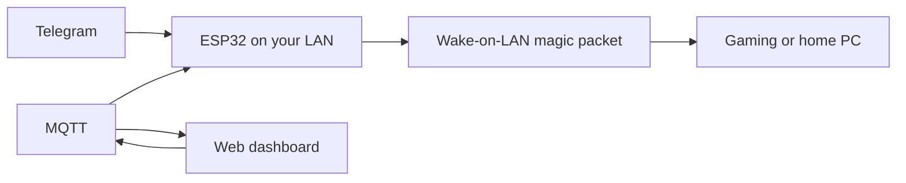

# ESP32 Wake-on-LAN Remote

[](LICENSE)
[](https://www.espressif.com/)
[](https://core.telegram.org/bots)
[](dashboard/README.md)

**Turn on your gaming or home PC from Telegram, MQTT, or a private web dashboard — without port forwarding or a cloud subscription.**

An ESP32 stays on your home network and sends a Wake-on-LAN magic packet to your PC. Control it remotely through Telegram, MQTT automation, or the included browser dashboard.


## Why this exists

Useful for gaming PCs, Moonlight/Sunshine streaming, home labs, and desktops that normally stay powered off. Send `/wake` from Telegram, press **WAKE PC** in the dashboard, or publish an MQTT command. The ESP32 handles the local network part.

## How it works



The ESP32 must remain connected to your local network. Telegram and MQTT provide the remote control path; the PC does not need a public IP or port forwarding.

## What it does

- **Wake your PC** with a confirmation step or immediate force mode
- **Check PC status** with a TCP probe
- **Diagnose the ESP32** with reset reason, heap, WiFi RSSI, uptime, and poll health
- **Recover automatically** with a watchdog and WiFi reconnect backoff
- **Control through MQTT** with TLS, retained state, replies, and events
- **Use the private web dashboard** over MQTT WebSocket
- **Send important health events to Grafana Cloud Loki** optionally

## Quickstart: Telegram

This is the simplest way to verify the project works.

### You need

- Any ESP32 board
- A PC with Wake-on-LAN enabled in BIOS, the OS, and the network adapter
- WiFi access for the ESP32
- [Arduino CLI](https://arduino.github.io/arduino-cli/)
- A Telegram bot token from [@BotFather](https://t.me/BotFather)

First, enable and test Wake-on-LAN on the PC using the [Wake-on-LAN setup guide](docs/wake-on-lan.md). If the PC cannot wake from another WoL tool, the ESP32 cannot fix it.

### Build and flash

```bash
arduino-cli core update-index
arduino-cli core install esp32:esp32
cp config.example.h config.h
# Fill in WiFi, BOT_TOKEN, PC_MAC, PC_IP, and WOL_BCAST in config.h

arduino-cli compile --fqbn esp32:esp32:esp32 .
arduino-cli upload --fqbn esp32:esp32:esp32 -p /dev/ttyUSB0 .
```

Replace `/dev/ttyUSB0` with your ESP32's serial port. At least one control method must be configured: Telegram or MQTT.

After flashing, open your bot in Telegram and send `/help`, then `/wake`. The bot asks for confirmation before sending the packet.

See [Telegram bot setup](docs/telegram.md) for the complete guide.

## Telegram commands

| Command | What it does |
|---------|-------------|
| `/help` or `/start` | Show the command menu |
| `/ping` | Show ESP32 diagnostics |
| `/status` | Show ESP32 health and PC online status |
| `/wake` | Request wake confirmation |
| `/wake force` | Send the Wake-on-LAN packet immediately |
| `/reboot` | Reboot the ESP32 |

Leave `BOT_TOKEN` blank to disable Telegram and use MQTT only.

## MQTT control

MQTT is optional. Configure these values in `config.h` to enable MQTT over TLS, normally on port `8883`:

- `MQTT_BROKER`
- `MQTT_PORT`
- `MQTT_USER`
- `MQTT_PASS`
- `MQTT_BASE_TOPIC` (for example, `home/pc-remote/desktop-01`)

Install the MQTT library if you enable it:

```bash
arduino-cli lib install PubSubClient
```

Topics under `MQTT_BASE_TOPIC`:

| Topic | Retain | Purpose |
|-------|--------|---------|
| `/availability` | Yes | ESP32 online/offline state |
| `/state` | Yes | Latest ESP32 and PC status |
| `/cmd` | No | Action commands |
| `/reply` | No | Command replies |
| `/event` | No | One-time events |
| `/log` | No | Live debug logs |

Commands on `/cmd`:

```text
ping
wake_request
wake_confirm
reboot_request
reboot_confirm
```

`wake_request` accepts `force: true` to skip confirmation. `/state` is refreshed when values change and every 60 seconds, and includes `pc_online` and `pc_status`.

Example wake request:

```json
{"id":"wake-001","cmd":"wake_request","target":"desktop-pc","force":true,"expires_in_s":30,"ts":1783586658}
```

If Telegram and MQTT are both configured, both control paths remain available.

## Private web dashboard

The `dashboard/` directory contains a React + Vite + TypeScript browser dashboard for MQTT control.

- **Transport:** MQTT over WebSocket
- **Deploy:** Cloudflare Pages
- **Private access:** Cloudflare Access with GitHub login
- **Features:** wake confirmation, PC status, ESP32 health, MQTT replies, events, and logs

Run locally:

```bash
cd dashboard
cp .env.example .env
bun install
bun run dev
```

Build for deployment:

```bash
bun run build
```

See the [dashboard setup guide](dashboard/README.md) for Cloudflare Pages, Access, environment variables, and MQTT ACLs.

> **Security:** Dashboard `VITE_*` credentials are embedded in the browser bundle and can be inspected by anyone who can access the site. Use Cloudflare Access and a dedicated MQTT user with restricted topic ACLs.

## Configuration

Copy `config.example.h` to `config.h` and fill in the values for your setup:

```c
#define WIFI_SSID     "your-wifi-ssid"
#define WIFI_PASS     "your-wifi-password"
#define BOT_TOKEN     ""                    // optional Telegram token
#define PC_NAME       "gaming-pc"
#define PC_MAC        "aa:bb:cc:dd:ee:ff"
#define PC_IP         "192.168.1.50"
#define WOL_BCAST     "192.168.1.255"
#define WOL_PORT      9
#define PC_TCP_PORT   47989                 // Moonlight, SSH, SMB, etc.
```

Use a static IP or DHCP reservation for the PC so the ESP32 can reliably check its status.

## Requirements and limitations

- Any ESP32 board supported by the `esp32:esp32` Arduino core
- `PubSubClient` if MQTT is enabled
- Wake-on-LAN must work from the same LAN before using this project
- The ESP32 needs power and WiFi while the PC is off
- The dashboard requires an MQTT broker with WebSocket support

## Troubleshooting

**PC will not wake**

- Verify WoL in BIOS and the OS/network adapter settings
- Disable ErP / ErP-ready if it removes power from the NIC
- Test the PC with another WoL tool first
- Confirm `PC_MAC` and `WOL_BCAST` are correct

**ESP32 keeps rebooting**

- Check `/ping` for the reset reason
- `task_wdt` means the main loop hung and the watchdog recovered it
- `brownout` usually means the power supply is too weak

**Telegram bot does not respond**

- Confirm `BOT_TOKEN` matches the token from BotFather
- Check that the ESP32 has WiFi
- Wait a few seconds after boot for Telegram polling to start

**MQTT does not connect**

- Check broker, port, username, password, and base topic
- Confirm the broker accepts TLS on port `8883`
- For the dashboard, confirm the broker supports MQTT over WebSocket

## Optional Grafana Cloud logging

Send boot, WiFi, and watchdog events to Grafana Cloud Loki:

1. Create a [Grafana Cloud](https://grafana.com) account
2. Fill in `GRAFANA_LOGS_URL`, `GRAFANA_LOGS_USER`, and `GRAFANA_LOGS_TOKEN` in `config.h`
3. Leave them blank to disable logging

Logs use the stream `{app="esp32-pc-remote"}`. See the [Grafana setup guide](docs/grafana.md).

## Contributing

Issues and pull requests are welcome. Keep `config.h` out of commits. See [CONTRIBUTING](CONTRIBUTING.md).

## License

MIT

If this project helps you, consider [starring the repository](https://github.com/Jonathan0823/esp32-pc-remote). ⭐
